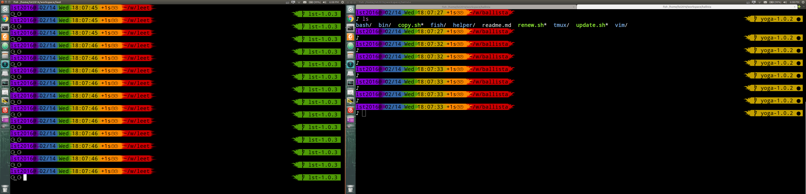

# Fish shell
config file for [The user-friendly command line shell](http://fishshell.com/)

## Dependency

### powerline font

[Link for install](https://askubuntu.com/questions/283908/how-can-i-install-and-use-powerline-plugin)

## Screenshots

## Todo
### uniform arrow (use same function)

## Ref
- [Oh My Fish Themes](https://github.com/oh-my-fish/oh-my-fish/blob/master/docs/Themes.md)
