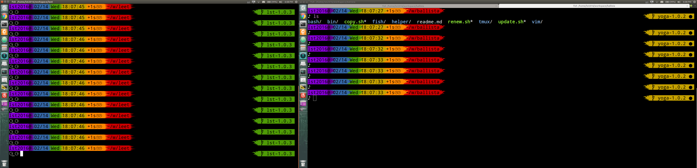

# Ballista

## Backup for
- rc: bash, profile, fish shell, tmux, vim  
- helper scripts used by rc
- configuration scripts
- independent helper scripts 
## Notes
This project is located in ~/workspace/ on my machine. Some file(s) in this project may be used directly from rc scripts.
## Stable
- yoga-1.0.0
- yoga-1.0.1
- yoga-1.0.2
